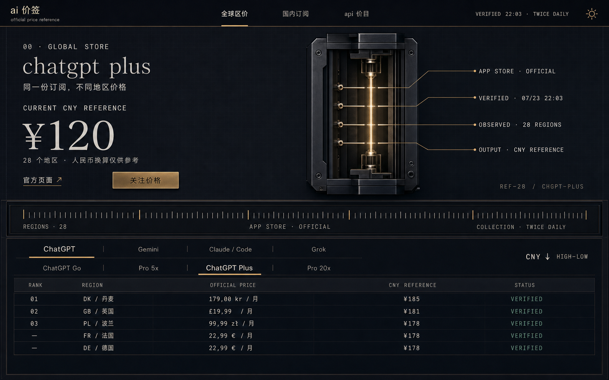

<!-- Hallmark · pre-emit critique: P5 H5 E5 S5 R5 V5 -->

# Design v3 — AI Price Atlas / Lumen Observatory

> 状态：高端未来科技 AI 方向，尚未实施  
> 视觉系统：Hallmark Atmospheric · Lumen Night Foundry  
> 边界：不改变数据、功能、路由、排序、订阅、校验及可访问语义。

## 1. 核心概念

### Lumen Observatory

把 AI 价签设计成一台运行中的“模型价格观测仪”。

未来感不来自蓝紫渐变、玻璃卡片、粒子和发光球，而来自：

- 精确的暗色材料与光源关系。
- 一台有明确功能的来源验证装置。
- 真实价格、时间、地区数量和状态标注。
- 机械刻度、测量带、等宽数字与受控发光。
- 大片安静空间与极少量黄铜信号。

页面的中心不是营销 Hero，而是当前产品的价格读数和来源证据。

关键词：

**premium ai laboratory · optical instrument · night foundry · calibrated data · quiet intelligence**

## 2. 为什么与 V2 不同

V2 是黑白编辑交易板，强调印刷、排名和公告感。

V3 改为：

- 深紫近黑的整屏工作环境。
- 上半屏为观测与来源验证，下半屏为价格矩阵。
- 金属黄铜作为唯一能量信号。
- Instrument Serif、Geist 与 JetBrains Mono 三种字体分工。
- 发光来自单一装置内部，不从背景四处冒出。
- 空间更安静、纵深更强、技术感更精密。

## 3. Hallmark 选型

- **Genre**：atmospheric
- **Theme**：Lumen
- **Drop**：Night Foundry
- **Macrostructure**：Workbench，应用级改造
- **Central apparatus**：Price Provenance Chamber / 价格来源验证舱
- **Motion**：filament-pulse、selection-track、sheet-path
- **Enrichment**：纯 CSS / SVG 装置；不使用生成式装饰图片

## 4. 视觉材料

### 色彩

| Token              | OKLCH                       | 用途               |
| ------------------ | --------------------------- | ------------------ |
| `--color-paper`    | `oklch(13% 0.014 265)`      | 深紫近黑主画布     |
| `--color-paper-2`  | `oklch(17% 0.016 265)`      | 抬升表面           |
| `--color-paper-3`  | `oklch(21% 0.018 265)`      | 活动行、sheet      |
| `--color-ink`      | `oklch(96% 0.006 262)`      | 标题与主要金额     |
| `--color-ink-2`    | `oklch(78% 0.010 262)`      | 正文               |
| `--color-muted`    | `oklch(58% 0.012 264)`      | 元信息             |
| `--color-rule`     | `oklch(31% 0.014 265)`      | 规则线             |
| `--color-rule-2`   | `oklch(25% 0.014 265)`      | 次级规则线         |
| `--color-accent`   | `oklch(76% 0.17 50)`        | 熔融黄铜信号       |
| `--color-accent-2` | `oklch(68% 0.16 18)`        | 珊瑚色动词/警示    |
| `--color-glow`     | `oklch(80% 0.16 50 / 0.42)` | 装置内部光         |
| `--color-verified` | `oklch(76% 0.12 145)`       | 已核验，小面积     |
| `--color-warning`  | `oklch(72% 0.15 75)`        | 可能过期、等待采集 |
| `--color-negative` | `oklch(63% 0.17 28)`        | 错误               |
| `--color-focus`    | `oklch(80% 0.19 50)`        | 键盘焦点           |

约束：

- 黄铜只出现在验证舱、活动线、主动作和焦点。
- 背景不使用蓝紫渐变。
- 发光面积不得大于验证舱。
- 状态色必须同时出现符号和文字。

### 字体

- Display：`Instrument Serif`, `"Noto Serif SC"`, serif；400，upright。
- Body：`Geist`, `"Noto Sans SC"`, sans-serif；400 / 500 / 600。
- Label / Data：`JetBrains Mono`, `"SFMono-Regular"`, Consolas, monospace。

规则：

- 英文 prose 默认小写。
- 中文保持自然字形，不强制转换。
- 技术标签使用 UPPERCASE mono。
- 价格、时间、币种、地区代码使用 tabular numerals。
- 全站不使用斜体。
- 不使用系统字体作为展示字体。

### 形状与纵深

- 面板圆角 `6–10px`，避免大圆角。
- 默认表面无外发光。
- 价格验证舱是唯一主动发光物体。
- 抬升层用内侧光和极弱实体阴影，不使用玻璃模糊。
- 蓝图网格 48px，仅 4% 对比。

## 5. 桌面空间结构

适用：`≥ 1180px`

```text
┌─────────────────────────────────────────────────────────────────────────────┐
│ ai 价签        全球区价   国内订阅   api 价目       VERIFIED 22:03   ◐     │
├─────────────────────────────────────────────────────────────────────────────┤
│                                                                             │
│  00 · GLOBAL STORE                    ┌── PRICE PROVENANCE CHAMBER ──────┐  │
│  chatgpt plus                         │ APP STORE        OFFICIAL         │  │
│  同一份订阅，不同地区价格             │ ─────────────────────────────── │  │
│                                      │ VERIFIED         07/23 22:03     │  │
│  CURRENT CNY REFERENCE               │ ─────────────────────────────── │  │
│  ¥120                                │ OBSERVED         28 REGIONS      │  │
│  28 个地区 · 仅供参考                 │ ─────────────────────────────── │  │
│                                      │ OUTPUT           CNY REFERENCE   │  │
│  [官方页面 ↗]  [关注价格]             └──────────────────────────────────┘  │
│                                                                             │
├─ REGIONS · 28 ──────────────── STATIC MEASUREMENT STRIP ─── TWICE DAILY ──┤
│                                                                             │
│  ChatGPT   Gemini   Claude / Code   Grok      套餐：Go / Pro / Plus / 20x  │
│ ─────────────────────────────────────────────────────────────────────────── │
│  01  DK / 丹麦        179,00 kr / 月         ¥185                          │
│  02  GB / 英国        £19.99 / 月            ¥181                          │
│  03  PL / 波兰        99,99 zł / 月          ¥178                          │
│  —   FR / 法国        22,99 € / 月           ¥178                          │
└─────────────────────────────────────────────────────────────────────────────┘
```

### 页面分区

1. Edge Navigation：56–64px。
2. Observatory Field：约 410px。
3. Static Meter Strip：40px。
4. Price Matrix：剩余空间。

不使用常规 sidebar + card dashboard。

## 6. Edge Navigation

- 左侧：`ai 价签` 小写字标与“official price reference”。
- 中部：三种模式。
- 右侧：`VERIFIED 22:03`、每日两次、主题切换。
- 只使用底部 1px 规则线。
- 当前模式用短黄铜线，不使用 pill。
- 导航不悬浮、不毛玻璃。

## 7. Observatory Field

### 左侧：价格读数

- 技术标签：`00 · GLOBAL STORE`。
- 标题：`chatgpt plus`，Instrument Serif，64–88px。
- 中文说明保留现有“同一份订阅，不同地区价格”。
- `CURRENT CNY REFERENCE` 为 mono 标签。
- `¥120` 使用 112–152px 的 serif / mono 数字组合。
- `28 个地区 · 人民币换算仅供参考` 位于读数下方。
- 官方页面为文字外链。
- “关注价格”为唯一黄铜实心按钮。

巨大价格不放入 KPI 卡，也不配虚构趋势。

### 右侧：Price Provenance Chamber

这是全页唯一的手工精密装置，表达已有的数据链：

```text
OFFICIAL SOURCE
      ↓
LAST VERIFIED
      ↓
OBSERVED REGIONS
      ↓
CNY REFERENCE
```

装置组成：

- 一块竖向深色腔体。
- 中央 2px 黄铜光丝。
- 四条水平电极对应四个真实阶段。
- 两侧 leader lines 标注：
  - `APP STORE · OFFICIAL`
  - `07/23 22:03`
  - `28 REGIONS`
  - `CNY · REFERENCE`
- 底部印有 `REF-28 / CHGPT-PLUS`。

限制：

- 不使用球体、圆环、AI 大脑、神经网络或粒子。
- 不编造延迟、模型参数、频率或性能数值。
- 装置只使用现有来源、时间、地区数量和价格类型。
- 装置的脉冲幅度不超过 3%，周期 4 秒。

## 8. Static Meter Strip

位于观测区和价格矩阵之间：

- 60–80 根细刻度，使用静态包络排列。
- 左标签：`REGIONS · 28`
- 中标签：`APP STORE · OFFICIAL`
- 右标签：`COLLECTION · TWICE DAILY`
- 刻度不动画，不暗示实时波动。
- 只表示采集范围与来源状态，不表示趋势。

## 9. Price Matrix

### 产品与套餐

- 产品切换为一条横向 instrument rail。
- 产品图标统一单色，选中产品才使用黄铜。
- 套餐位于第二条细轨道。
- 活动项使用短线和明亮文字，不使用胶囊。

### 报价行

结构：

```text
RANK   REGION        OFFICIAL PRICE       CNY REFERENCE       STATUS
```

- 前三名显示 `01–03`。
- 地区显示 ISO + 中文名称。
- 官方价格与人民币参考清晰分列。
- API 模式将最后一列替换为计费单位。
- 行间只用规则线，不做彩色渐变或卡片。
- 已核验、可能过期、等待采集、未公开固定价均使用符号 + 文本。
- 不可比较项目不显示排名。

### 排序

- `CNY ↓ HIGH–LOW`
- `CNY ↑ LOW–HIGH`
- 只改变现有人民币排序方向。
- 切换时数字列 120ms 淡入，不做逐行动画。

## 10. 订阅交互

桌面：

- 从右侧边缘进入 `watch price` sheet。
- sheet 采用 `--color-paper-2`，验证舱退到低对比背景。
- 当前产品与套餐以 mono scope 显示。
- 只有邮箱、提交和关闭动作。

手机：

- 从底部进入。
- 避开 safe area 和软键盘。

保持现有行为：

- 打开时聚焦邮箱。
- Escape、backdrop、关闭按钮均可关闭。
- Tab 焦点循环，关闭后返回触发按钮。
- submitting 禁止重复提交。
- success 原位提示查收确认邮件。
- error 使用 `role="alert"`。
- success 使用 `role="status"`。

## 11. 手机结构

适用：`320 / 375 / 414px`

顺序：

1. 52px edge navigation。
2. 三模式文本轨道。
3. 产品与套餐轨道。
4. `chatgpt plus` 与巨大 `¥120`。
5. 横向缩小后的 provenance chamber。
6. static meter strip。
7. 两层报价行。
8. 底部固定“关注价格”。

移动端验证舱：

- 由竖向腔体变为横向四阶段线路。
- 四个标注允许两行，但触点文字不得两行。
- 发光强度降低，避免压过价格。

报价行：

```text
01  DK / 丹麦             ¥185
    179,00 kr / 月         VERIFIED
```

约束：

- 页面无横向滚动。
- 只有产品和套餐轨道可局部滚动。
- 点击目标至少 44×44px。
- 价格与单位不得截断。
- sheet 打开时隐藏底部关注栏。

## 12. 文档与结果页

### `/methodology`

- 深色蓝图网格背景。
- 单栏 720px 正文。
- 右侧保留缩小的来源验证舱。
- 来源、采集、异常保留、换算四节使用 mono 标签。

### `/privacy`

- 同一内容骨架。
- 首屏突出“不营销、不出售邮箱、仅用于价格通知”。
- 不新增法律或合规承诺。

### `/subscription/result`

- 使用一个大型状态词与单一光丝：
  - `confirmed`
  - `unsubscribed`
  - `link expired`
- 中文解释和一个返回动作。
- 不增加营销 CTA。

## 13. 动效

- `--dur-fast: 120ms`
- `--dur-base: 180ms`
- `--dur-sheet: 260ms`
- `--dur-pulse: 4000ms`
- `--ease-out: cubic-bezier(0.16, 1, 0.3, 1)`
- `--ease-in-out: cubic-bezier(0.65, 0, 0.35, 1)`

允许：

- 验证舱光丝 3% 强度脉冲。
- 模式、产品、套餐活动线移动。
- 数字 opacity 交叉淡入。
- sheet 沿同一路径进入和退出。

禁止：

- 旋转装置。
- 粒子系统。
- 磁吸光标。
- 视差。
- 卡片翻转。
- 大面积持续流动光效。
- 动画布局属性和阴影。

Reduced motion：

- 光丝固定为最大强度。
- 移除所有空间运动。
- opacity 最多 150ms。

## 14. 八状态

所有模式、产品、套餐、按钮和输入覆盖：

1. default
2. hover
3. focus-visible
4. active
5. disabled
6. loading
7. error
8. success

- focus ring 立即显示。
- disabled 仍可读。
- loading 保持按钮宽度。
- active 最多 `translateY(1px)`。
- 状态不只依赖颜色。

## 15. 功能不变

保留：

- 三种价格模式。
- 产品与套餐选择。
- 合法默认值重置。
- 地区、原币、人民币参考、账期、API 单位。
- 人民币升降排序。
- `verified / stale / pending / unpublished`。
- 官方来源、最后核验时间。
- 全球模式按产品 + 套餐订阅，其他模式按产品订阅。
- 双重确认、退订和结果状态。
- 明暗主题及现有存储键。
- 方法、隐私、数据纠错入口。

不新增：

- 搜索、账号、快捷键、收藏、图表、趋势、预测、推荐。
- 虚构指标、参数、评价、合作 Logo 或价格。
- 可展开的额外来源功能。

## 16. 反模板约束

禁止：

- 蓝紫渐变。
- 发光球、圆环或 AI 大脑。
- 玻璃拟态。
- 全屏粒子。
- 赛博朋克 HUD。
- 六边形、扫描线、代码雨。
- 无意义图表和波形。
- 浮动卡片墙。
- 巨大圆角。
- 多色霓虹。
- 虚构技术参数。

高端感来自材料、比例、字体、真实标注和克制，而不是效果数量。

## 17. 验收

检查：

- `320 / 375 / 414 / 768 / 1024 / 1440px`
- 200% 缩放
- 无页面横向滚动
- 44px 最小触点
- 键盘完整操作
- 明暗对比度
- 焦点顺序与视觉顺序一致
- sheet 焦点循环、滚动锁、Escape 和焦点返回
- 所有状态有文字
- 价格、来源和换算语义不混淆
- reduced-motion 下无持续动画

## 18. 视觉示例



文件：`docs/ai-price-atlas-redesign-preview-v3.png`

示例图用于确认整体构图、材料、字体、装置和信息层级。图中数据只取自现有产品示例，真实实现继续读取 catalog / repository，不能写死。
